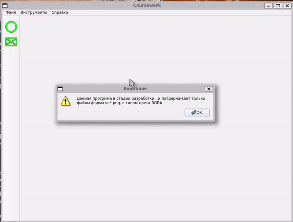

# Qt_paint_coursework
Курсовая работа 2сем по "Программированию" 2021г
 
 

## Запуск
> [!WARNING]  
> Для запуска должны быть установлены библиотукие Qt6 такие как : qt6-base-dev, libqt6widgets  
> OC: Linux

## Файловая организация
* `src/` - содержит исходный код приложения
* `build/` - исполнительный бинарный файл  
* `gif/` - содержит gif для readme
* `task.pdf` - содержит задания курсовой работы
